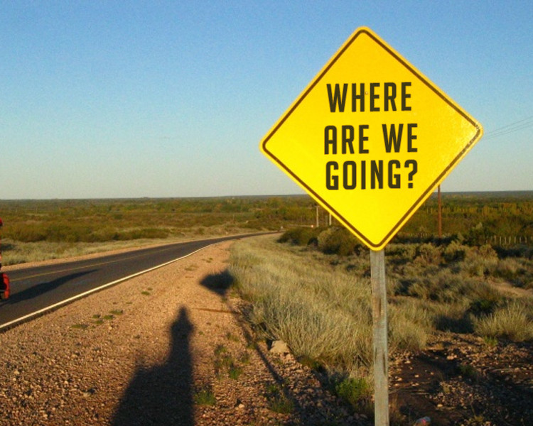
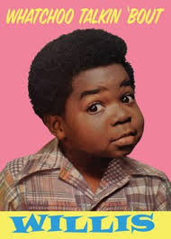
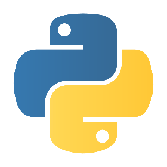
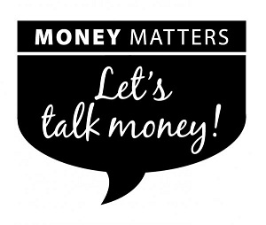
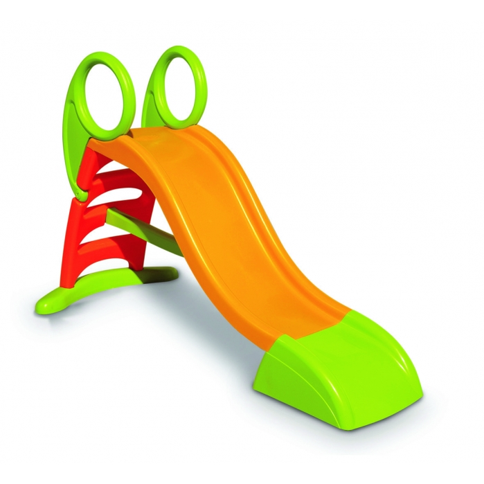

=======================
Python en el mundo real
=======================

----

Hola!
-----

    
----

¿Quién Habla?
-------------

Matías Herranz
--------------

- (almost)Lic. en Ciencias de la Computación.
- FAMaF - UNC
- ¡Música!
- Algunos proyectos: PyRadar, NinjaIDE, django-notification, django-post, django-migration-tools, etc.

----

¿Y con Python?
--------------

- Trabajo con Python día a día.
- Hice mi tesis de grado en Python.
- Soy miembro de PyAr.
- Hago ciencia con Python.
- Hace más de 5 años que vivo (principalmente) de programar Python y Python/Django.

----

¿De qué va la charla?
---------------------

- Ejemplos de su sintaxis en casos didácticos
- Programas hechos en Python.
- Empresas que apuestan fuerte por (¡y ganan fuerte con!) Python
- Comunidad de Python
- Frameworks hechos en Python

¡Y vamos a hablar de plata todo el tiempo!

----

¿Y Python?
----------

- Python es un lenguaje de programación interpretado cuya filosofía hace
  hincapié en una sintaxis muy limpia y que favorezca un código legible.
- Lo crea Guido Van Rossum en 1991.
- Multiparadigma.
- Multiplataforma.
- Comunidad MUY activa e inclusiva.
- Multiples implementaciones: Jython, IronPython, PyPy, CPython...

----

¿Y la plata?
------------

y... es simple (según las estadísticas todo es 1/3 de Java y C#)

- 1/3 de tiempos de desarrollo.
- 1/3 de costo de mantenimiento (producto de que sea fácil de leer y entender).
- 1/3 de costos.
- ¡1/3 de time to market!

----

Por cierto...
-------------

- Estos slides estan generados con Landslide (que está hecho con Python)
- Homepage: https://github.com/adamzap/landslide

