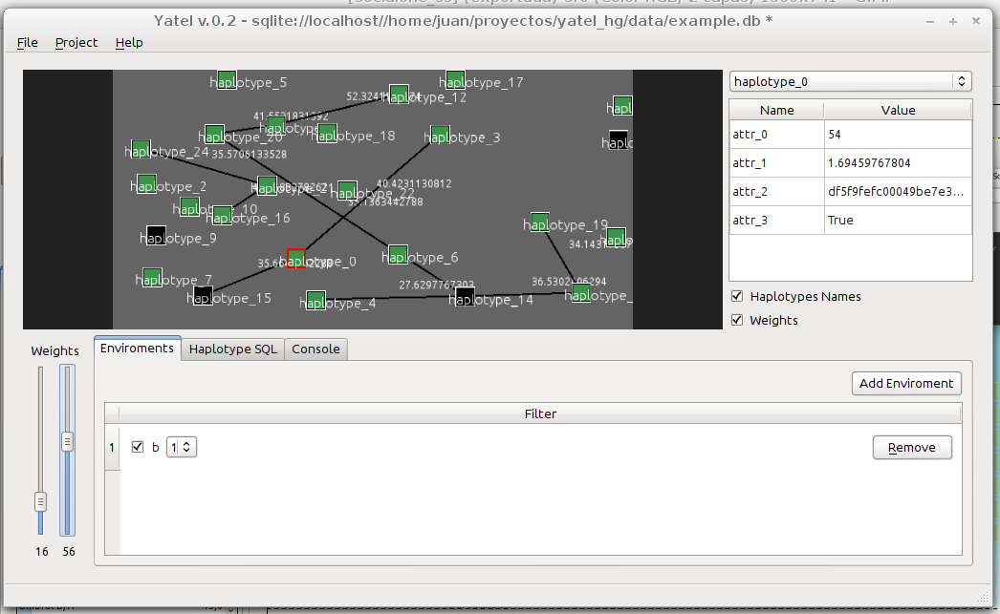
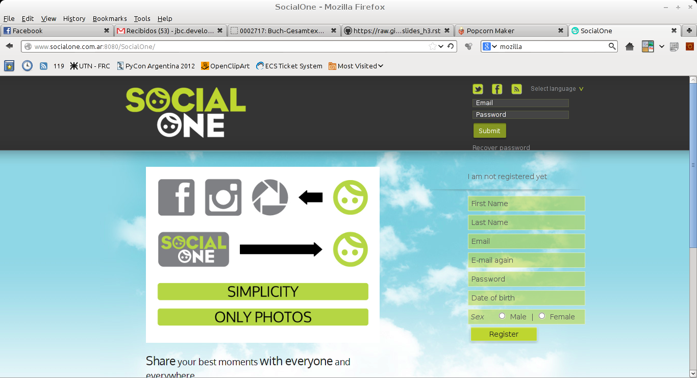
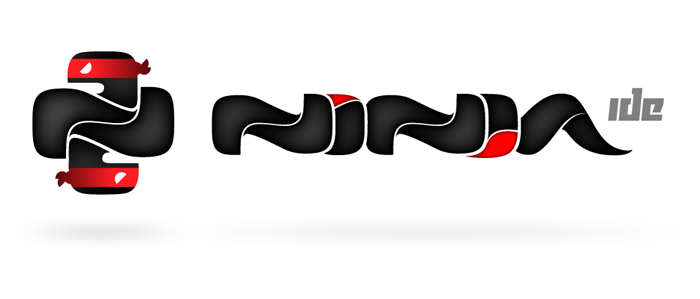
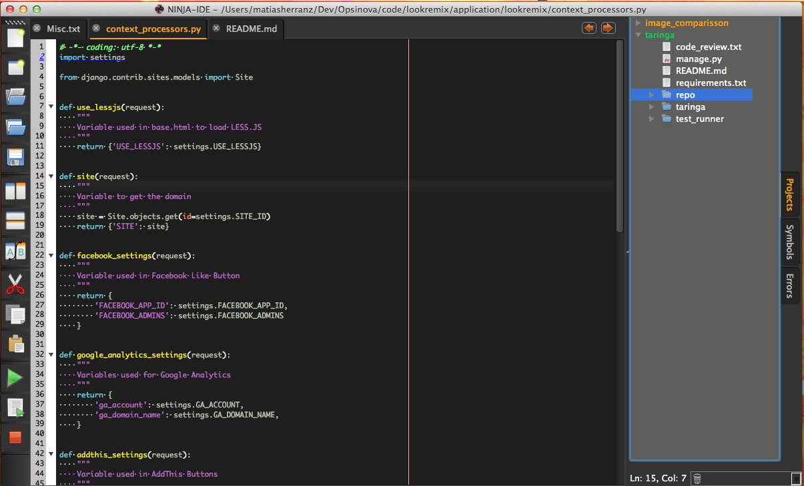
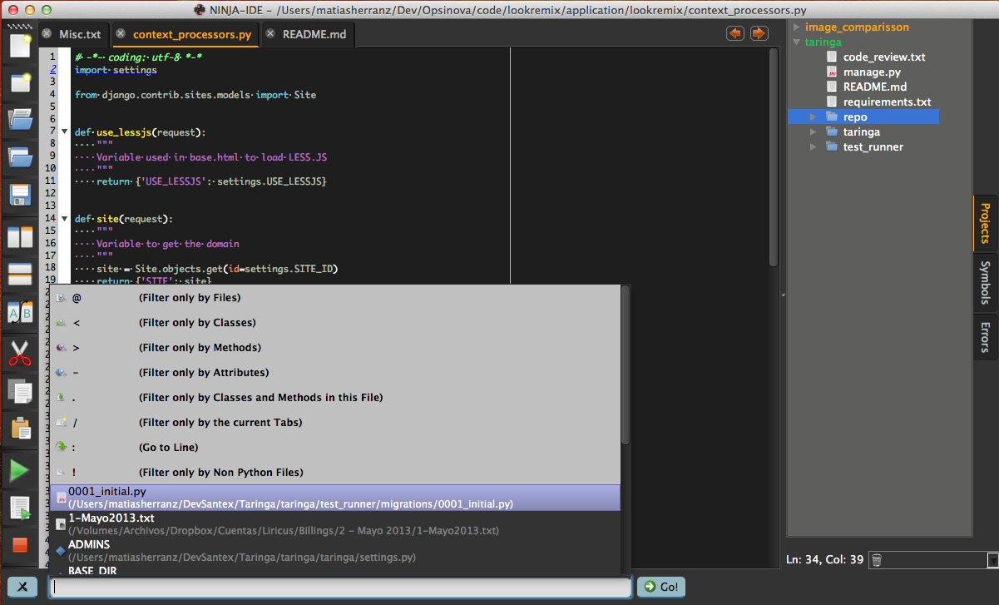

Yatel
-----

.. image:: img/yatel_logo.png
    :align: center

- Es una herramienta de data-mining.
- Se utiliza para análisis de perfiles genéticos en el INTA-IFFiVe (Instituto Nacional de Tecnología Agropecuaria - Instituto de Fitopatología y Fisiología Vegetal).
- Utilizable como librería.
- 100% Python.
- Utiliza: PyQt, Pilas, Peewee, IPython.

----

Yatel
-----

----

SocialOne
---------

- Es una solución para compartir fotos de manera centralizada.
- Esta alojado en http://www.socialone.com.ar (cuenta con un cliente Android).
- Backend 100% Python, con comunicación vía una API REST/JSON.
- Utiliza: Flask, Python Image Library (PIL).

- Spin-off: Social Abu.

----

SocialOne
---------

----

PyQt
----

.. image:: img/pyqt_logo.png
    :align: center

- Binding Python a la librería grafica QT, que está hecha en C++.
- Posee un editor visual de formularios (QtDesigner).
- Homepage: http://www.riverbankcomputing.co.uk/software/pyqt/intro

----

PyQt (Ejemplo)
--------------

.. code-block:: python

    from PyQt4.QtCore import *
    from PyQt4.QtGui import *
    import sys
 
    class Controles(QWidget): 
        def __init__(self, *args): 
            QWidget.__init__(self, *args)
 
            contenedor = QVBoxLayout()
            self.setLayout(contenedor)
 
            label = QLabel("Texto: ")
            contenedor.addWidget(label)
 
            self.qle_texto = QLineEdit()
            contenedor.addWidget(self.qle_texto)
 
            btnBorrar = QPushButton("Borrar",None)
            contenedor.addWidget(btnBorrar)
            self.connect(btnBorrar, SIGNAL("clicked()"), self.borrar)
 
            btnSalir = QPushButton("Salir",None)
            contenedor.addWidget(btnSalir)
            self.connect(btnSalir, SIGNAL("clicked()"), self.salir)
 
        def borrar(self):
            self.qle_texto.setText("")
 
        def salir(self):
            exit()
 
    if __name__ == "__main__":
        app = QApplication(sys.argv)
        controles = Controles()
        controles.show()
        sys.exit(app.exec_())

----

Sucess cases PyQt y/o Qt
------------------------

- VLC
- Google Earth
- Skype
- Clementine
- VirtualBox
- Mathematica
- KDE

----

Pilas
-----

.. image:: img/pilas_logo.png
    :align: center
    :scale: 150 %

- Un motor de videojuegos 100% en español (en proceso de traducción a otros lenguajes)
- Multiplataforma y ridiculamente-fácil de aprender.
- Desarrollado por un miembro de PyAr (Hugo Ruscitti)
- Embebible en widgets PyQt
- Homepage: http://www.pilas-engine.com.ar/
- Ejemplos oficiales: http://pilas-engine.com.ar/docs.html

----

Pilas (Ejemplo)
---------------

.. code-block:: python

    import pilas
    import time

    pilas.iniciar()

    mono = pilas.actores.Mono()
    mono.x, mono.y = 100, 100
    mono.aprender(pilas.habilidades.Arrastrable)

    bananas = pilas.actores.Banana() * 10
    bombas = pilas.actores.Bomba() * 5

    def mono_come_banana(mono, banana):
        mono.sonreir()
        banana.eliminar()

    def bomba_mata_mono(mono, bomba):
        bomba.explotar()
        mono.gritar()
        mono.eliminar()

    pilas.escena_actual().colisiones.agregar(mono, bananas, mono_come_banana)
    pilas.escena_actual().colisiones.agregar(mono, bombas, bomba_mata_mono)

    pilas.ejecutar()

----

Beautiful Soup
--------------

.. image:: img/bsoup_logo.png
    :align: center
    :scale: 100 %

- Es un parser HTML/XML laxo: ¡funciona bien incluso con código HTML/XML mal formado!
- Permite buscar de una manera **muy**, realmente **muy** flexible en código XML-like.
- Es raro y, a veces, hace cosas raras.
- Homepage: http://www.crummy.com/software/BeautifulSoup/

----

Beautiful Soup (Ejemplo, HTML)
------------------------

.. code-block:: python

    html = """
    <!DOCTYPE html PUBLIC "-//W3C//DTD XHTML 1.0 Strict//EN"
        "http://www.w3.org/TR/xhtml1/DTD/xhtml1-strict.dtd">
    <html xmlns="http://www.w3.org/1999/xhtml" xml:lang="en" lang="en">
    <head>
        <title>titulo</title>
    </head>
    <body>
        
este es un codigo feo<b>
        <a href="http://google.com">to google</a>
        <a href="http://www.google.com" id="unico">to google</a>
        <a href="http://yahoo.com">to yahoo</a>
        <ul class="some_class">
            <li>something</li>
        </ul>
        <ul class="some_class">
            <li>something</li>
        </ul>
        <ul class="other_class">
            <li>something</li>
        </ul>
    </body>
    </html>
    """

----

Beautiful Soup (Ejemplo, Python)
--------------------------------

.. code-block:: python

    import re
    import bs4

    soup = bs4.BeautifulSoup(html)

    print soup.find_all("a")
    # [<a href="http://google.com">to google</a>,
    #  <a href="http://www.google.com" id="unico">to google</a>,
    #  <a href="http://yahoo.com">to yahoo</a>]

    print soup.find("a", href="http://yahoo.com")
    # <a href="http://yahoo.com">to yahoo</a>

    print soup.find_all("a", href=re.compile(".*google[.]com"))
    # [<a href="http://google.com">to google</a>,
    #  <a href="http://www.google.com" id="unico">to google</a>]

    print soup.find("a", href=re.compile(".*google[.]com"), id="unico")
    # <a href="http://www.google.com" id="unico">to google</a>

    print soup.find("ul", class_="some_class").find_all("li")
    # [<li>something</li>]
    
----

Ninja-IDE
---------

- IDE hecha en Python y pensada para desarrolladores Python.
- Project Managment, amazing Code Locator, static errors and PEP8 checker, run Project and Files.
- Highly extensible with Plugins.
- El sitio de Ninja-IDE (http://ninja-ide.org/), ¡¡también está hecho en Python!!

----

Ninja-IDE: screenshots
----------------------

----

Ninja-IDE: Code Locator
-----------------------

----

Quepy
-----

- Proyecto open-source desarrollado desde el grupo de investigación de PNL de FaMAF.
- Quepy es un framework para transformar preguntas en lenguaje natural a consultas en un lenguaje de base de datos.
- Idea: con poco código podrías construir tu propio acceso a tu base de datos mediante lenguaje natural.
- Quepy provee soporte para el lenguaje de consultas sparql, pero puede ser extendido a otros lenguajes de consulta.

----

Quepy: Links!
-------------

- http://quepy.readthedocs.org/
- http://pypi.python.org/pypi/quepy/
