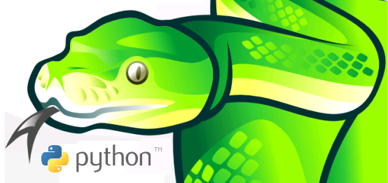
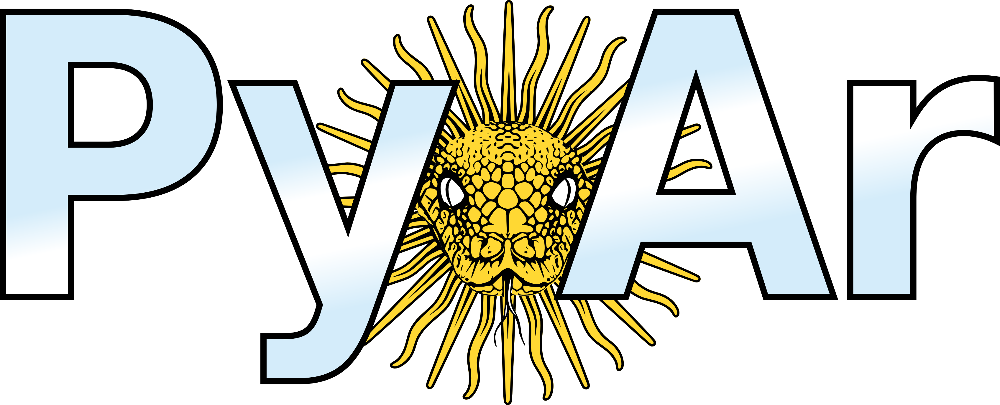

Ecosistema y Comunidad
----------------------

.. image:: img/xkcd.png
    :align: center
    :width: 440px
    :height: 500px

----

Ecosistema y Comunidad
----------------------

En los siguientes slides se veremos:

- La comunidad internacional de Python
- Grandes eventos internacionales
- Comunidad Local
- Eventos locales

    
----

Comunidad Internacional
-----------------------

- Expresividad del lenguaje => muchos hackers y científicos son miembros activos de esta comunidad.
- Se nuclea a través de la Python Software Foundation
- Hay dos miembros de PyAr en la PSF.
- ~200 conferencias anuales de Python en todo el mundo.

----

.. image:: img/pyconlogo.png
    :align: center
    :width: 480px
    :height: 270px

- Mayor conferencia de Python a nivel mundial.
- 5 mil asistentes.
- 15 días (el 03/2013 fue en Santa Clara, EEUU).

----

Muchas conferencias
-------------------

::

    - "PyCon" in United States
    - "EuroPython" in Europe
    - "EuroSciPy" in Europe
    - "Kiwi PyCon" in New Zealand
    - "PyCon Asia Pacific" in Singapore
    - "PyCon AR" in Argentina
    - "PyCon AU" in Australia
    - "PythonBrasil" in Brazil
    - "PyCon Canada" in Canada
    - "PyCon China" in China
    - "PyCon DE" in Germany
    - "PyCon ES" in Spain
    - "PyCon Finland" in Finland
    - "PyCon FR" in France
    - "PyCon India"
    - "PyCon Ireland"
    - "PyCon Italia" in Italy
    - "PyCon Japan"
    - "PyCon Philippines" in the Philippines
    - "PyCon PL" in Poland
    - "PyCon Russia" in Russia
    - "PyCon Taiwan" in Taiwan
    - "PyCon UK" in the United Kingdom
    - "PyCon Ukraine" in Ukraine
    - "PyCon Uruguay" in Uruguay
    - "PyCon Venezuela" in Venezuela
    - "PyCon ZA" in South Africa
    - "SciPy" in the United States
    - "SciPy.in" in India

----

- Una lista de correo con cerca de 400 personas activas.
- Alto nivel técnico.
- Recientemente fundado Sci-Pyar
- Homepage: http://python.org.ar

----

Eventos 2011
------------

- PyDay Córdoba 2011 (211 asistentes)
- PyDay Gonzales Catán (~70 asistentes)
- PyDay San Luis (~30 asistentes)
- Django Day Córdoba 2011 (~30 asistentes)
- PyConAr Junin 2011 (~270 asistentes)

.. image:: img/pydaycba2011.png
    :align: center

----

Eventos 2012
------------

- PyDay Junín 2012 (~50 asistentes)
- PyDay Córdoba 2012 (~100 asistentes)
- PyDay Rafaela 2012 (~30 asistentes (se llovió todo!))
- Pycon 2012 (403 asistentes)
- Django Day La Plata

----

Eventos 2013
------------

- SciPyCon Madrin 2013 (~200 asistentes)
- PyDay Rosario 2013
- (próximo) PyDay Junin 2013
- (próximo) Pycon 2013

----

.. image:: img/logopycon.png
    :align: center
    :width: 483px
    :height: 289px

- 403 asistentes, 9 invitados internacionales.
- 9 sprints.
- 2 eventos en paralelo.
- 10 tutoriales y workshops.
- 51 charlas programadas.

----

¡Nosotros!
----------

.. figure:: img/pyconarfinal.JPG
    :align: center
    :width: 960px
    :height: 539px
    
    Foto final PyConAr 2012
