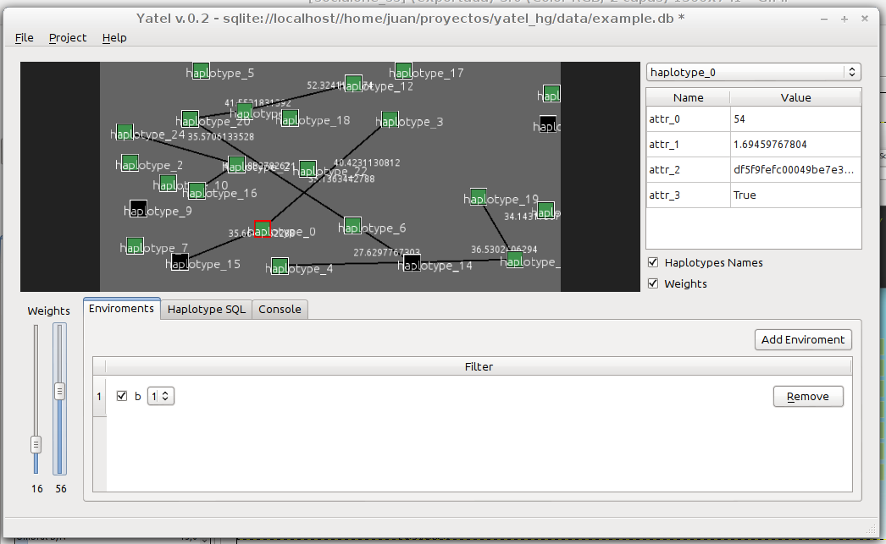
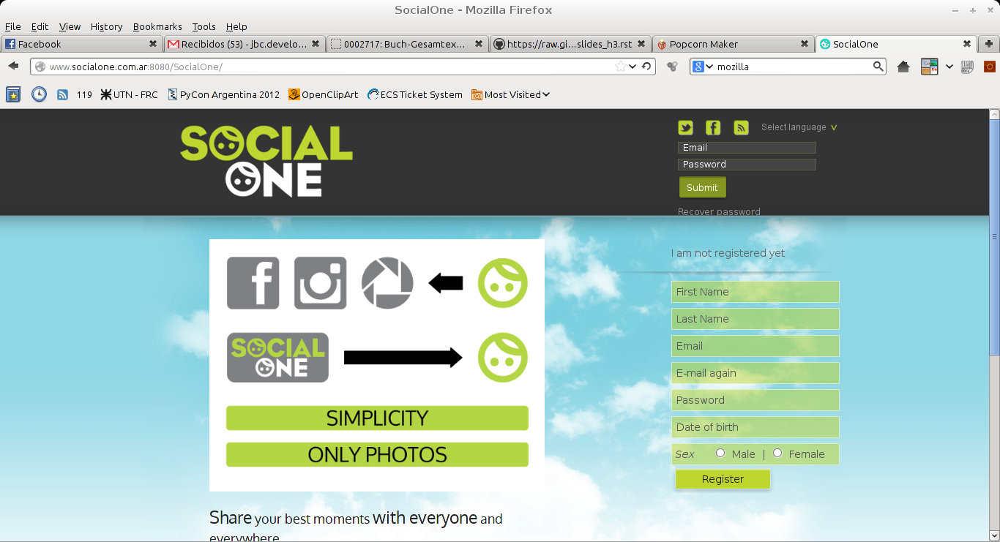

Yatel
-----

- Es una herramienta de datamining.
- Se utiliza par analisis de perfiles genéticos en el INTA-IFiVe.
- Utilizable como librería.
- 100% Python
- Utiliza: PyQt, Pilas, Peewee, IPython.

----

Yatel
-----

----

SocialOne
---------

- Es una solución para compartir fotos de manera centralizada.
- Esta alojado en http://www.socialone.com.ar (cliente Android)
- Backend 100% Python comunicación rest/json
- Utiliza: Flask, Python Image Library

----

SocialOne
---------

