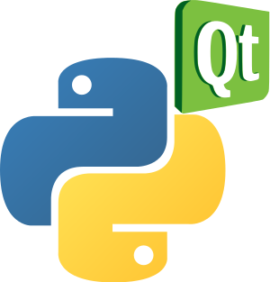

PyQt
----

- Es un binding a una librería grafica de de C++ (en realidad es mas que eso).
- Podee un editor visual de formularios (QtDesigner)
- Homepage: http://www.riverbankcomputing.co.uk/software/pyqt/intro

----

PyQt (Ejemplo)
--------------

.. code-block:: python

    import os
    from PyQt4 import QtCore, QtGui
    import pycante

    PATH = os.path.abspath(os.path.dirname(__file__))
    UI_DIR = pycante.EDir(PATH)

    class Dialog(UI_DIR("Dialog.ui")):

        def on_pushButton_clicked(self):
            text = self.lineEdit.text()
            self.label.setText("Hola " + unicode(text) + "!")

    app = QtGui.QApplication([])
    d = Dialog()
    d.show()
    app.exec_()

----

Pilas
-----

.. image:: img/pilas_logo.png
    :align: center
    :scale: 150 %

- Un motor de videojuegos 100% en español (en proceso de traducción)
- Multiplataforma y ridiculamente-facil de aprender.
- Desarrollado por un miembro de PyAr
- Embebible en widgets PyQt
- Homepage: http://www.pilas-engine.com.ar/

----

Pilas (Ejemplo)
---------------

.. code-block:: python

    import pilas
    import time

    pilas.iniciar()

    mono = pilas.actores.Mono()
    mono.x, mono.y = 100, 100
    mono.aprender(pilas.habilidades.Arrastrable)

    bananas = pilas.actores.Banana() * 10
    bombas = pilas.actores.Bomba() * 5

    def mono_come_banana(mono, banana):
        mono.sonreir()
        banana.eliminar()

    def bomba_mata_mono(mono, bomba):
        bomba.explotar()
        mono.gritar()
        mono.eliminar()

    pilas.escena_actual().colisiones.agregar(mono, bananas, mono_come_banana)
    pilas.escena_actual().colisiones.agregar(mono, bombas, bomba_mata_mono)

    pilas.ejecutar()
